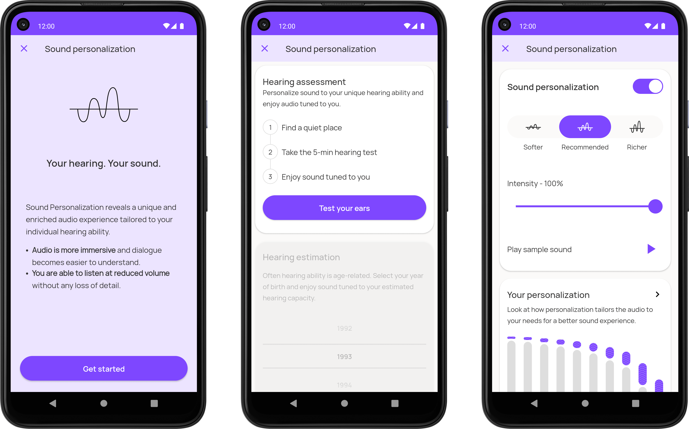
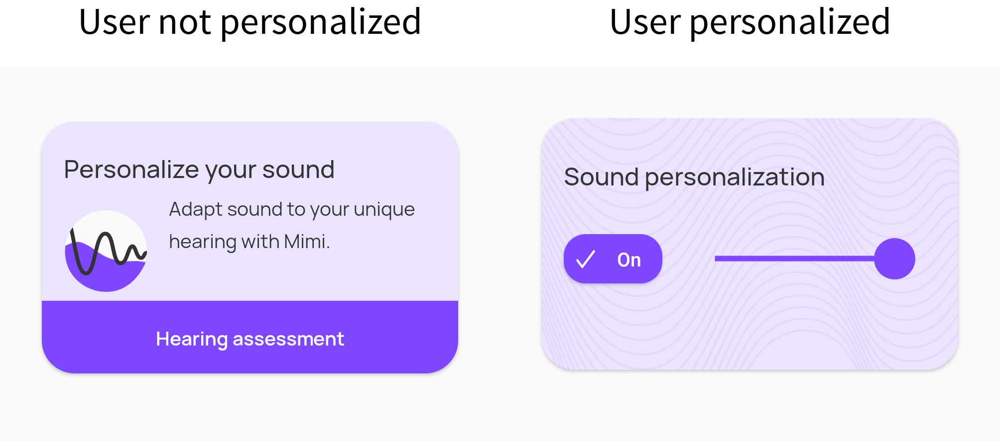

# Profile

## Components Intro

There are 2 components available:

`MimiProfileFragment`: The Mimi Profile Fragment is an expanded view that already contains all the necessary logic for users to personalize their sound, whether they prefer to do so in an easy and quick way, or in a more accurate way by taking a full Hearing Test. In addition, login and signup options are also provided via cards inside the Profile, allowing users to load their previously created Mimi data or save and persist their current data with a Mimi account.



`MimiProfileLauncher`: The Mimi Launcher Card Fragment is a compact view designed to give one-tap access to the Mimi Profile. It allows you to provide a seamless Mimi Profile experience within your app, while taking a minimal amount of space.
> Note: This fragment switches to a slider card once some information is provided that can be used to generate some valid presets. This can be done via taking a hearing test, (Profile) or providing a valid YoB (Demographically)



You can use these in two ways:

## Add using Kotlin

If you will be adding the Fragment into a `FragmentContainer` or `FrameLayout` dynamically, then make sure you are using the correct Fragment class from the correct package. You can check the import statement for this:

```kotlin
import io.mimi.sdk.profile.MimiProfileFragment
import io.mimi.sdk.profile.MimiProfileLauncher
```

## Add using XML in layout

When using  `FragmentContainer` or `fragment`,

`MimiProfileFragment`:

```xml
<androidx.fragment.app.FragmentContainerView
        android:id="@+id/mimiProfileFragment"
        android:name="io.mimi.sdk.profile.MimiProfileFragment"
        android:layout_width="match_parent"
        android:layout_height="match_parent"
        android:layout_gravity="center" />
```

`MimiProfileLauncher`:

```xml
<androidx.fragment.app.FragmentContainerView
        android:id="@+id/mimiProfileLauncher"
        android:name="io.mimi.sdk.profile.MimiProfileLauncher"
        android:layout_width="320dp"
        android:layout_height="200dp"
        android:layout_gravity="center" />
```

> Note: Adjust the `layout_width` and `layout_height` as per your requirements. We have provided something that usually works in the above example.

---

Once you have integrated the UI components, you need to setup the Mimi theme. This is important because without setting it up, your app will crash with the below error:

```error
Error inflating class androidx.cardview.widget.CardView
```

Now navigate to `AndroidManifest.xml` and check your `<application>` tag. Usually there is a theme already defined. Let's assume it is called `AppTheme`.

```xml
<application
    ...
    android:theme="@style/AppTheme" >
```

Now navigate to where `AppTheme` is defined (should be in `styles.xml` or `theme.xml` file under `res`) and replace value for `parent` with `Theme.Mimi`

```xml
<style name="AppTheme" parent="Theme.Mimi">
```

Now, run the app. Everything should be functional.

## [Read core docs for Theming](https://mimihearingtechnologies.github.io/SDK-Android/latest/theming/)
